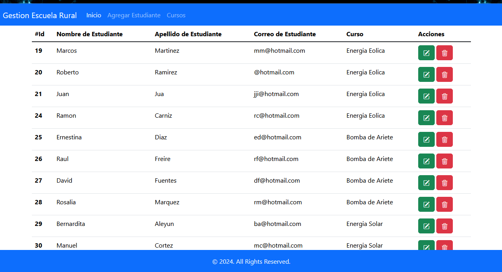
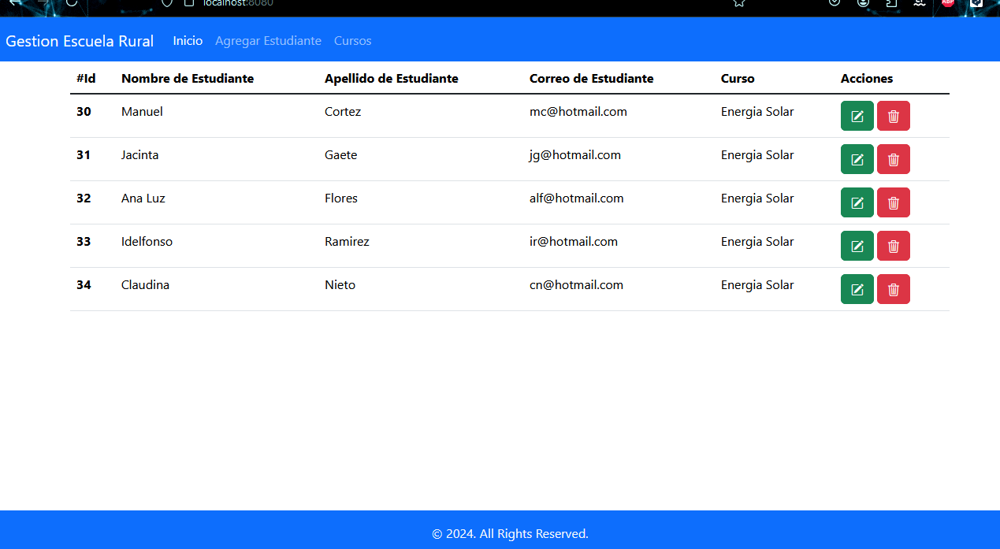

Desafío - Escuela Rural
--
En este desafío validaremos nuestros conocimientos de Spring Data JPA con asociaciones y
transaccionalidad. Para lograrlo, necesitarás aplicar todo lo aprendido en esta unidad.
Lee todo el documento antes de comenzar el desarrollo individual de este desafío, para
asegurarte de tener el máximo de puntaje y enfocar bien los esfuerzos. Una vez terminado el
desafío, comprime la carpeta que contiene el desarrollo de los requerimientos solicitados y
sube el .zip en el LMS.
Tiempo asociado: 2 hrs cronológicas.

Descripción
--
Una fundación asociada a una entidad educacional rural busca crear un sistema que registre
a los alumnos y los cursos a los cuales pertenecen cada uno de ellos, para así poder tener
completa la información de sus asistencias y permanencias en la escuela.
Deberás crear un sistema CRM que permita el ingreso, edición, selección y eliminación de los
alumnos, y que se visualicen en una pantalla principal. Lo mismo se necesita con los
diferentes cursos
Aplicando los conceptos y herramientas aprendidas hasta ahora, desarrolla los siguientes
requerimientos.

Requerimientos
--
Crea un proyecto Spring Boot llamado “EscuelaRural_JPA”.
1. Crear proyecto JPA, con las dependencias necesarias para la conexión a postgreSQL.
(2.5 Puntos)
2. Crea relaciones correspondientes entre Estudiantes y Cursos.
(2.5 Puntos)
3. Agregar transaccionalidad a las operaciones CRUD.
(2.5 Puntos)
4. Despliega información en vista JSP o Thymeleaf.
(2.5 Puntos)
¡Mucho éxito!

Consideraciones y recomendaciones
--
1. Se puede apoyar de los ejercicios vistos en unidades anteriores a modo de consulta.
2. Debes recordar el uso de anotaciones, la inyección de dependencias.
3. Puedes usar Lombok para reducir la cantidad de código.

imagenes del proyecto realizado

